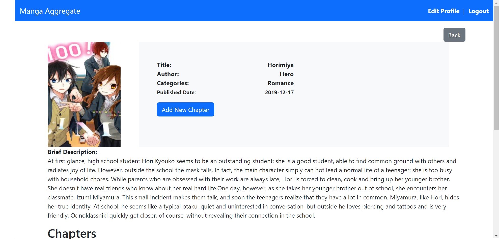

# Manga Aggregator

### Overview

The Manga Aggregator Application is a comprehensive platform built using Ruby on Rails. It allows users to explore and manage a collection of manga series, offering functionalities such as reading, rating, and commenting on manga. The application is designed with two distinct user personas: Admin and User.

**Live Demo:** You can access the live version of the application at [Manga Aggregator Live](https://mysite-4aoq.onrender.com/).

**Sample Admin Details:**

```
  Email: 21pa1a05e8@vishnu.edu.in
  Password: 123456
```

**Sample User Details:**

```
  Email: dummy@gmail.com
  Password: dummy1
```

### User Personas

#### Admin

Admins have elevated privileges within the application and are responsible for the following tasks:

Manage Manga: Admins can add, update, and delete manga entries, including uploading cover images and providing metadata like title, author, and description.
Chapter Creation: Admin can add a new chapter to manga whenever he desires to, by logging and navigating into his account.
An admin can also perform the actions that a user can do.

#### User

Regular users have access to a range of features for interacting with the manga content:

Explore Manga: Users can browse a catalog of manga, view details, and read chapters.
Rate and Comment: Users can rate manga on a 5-star scale and leave comments to share their opinions.
Search and Filter: Users can use search and filter options to find manga based on titles, categories, or other criteria.

### Home Page


The home page displays a list of available mangas with a search option. Both the admins and users will be displayed the new manga button but only the admins are given access.

### Manga Details



The manga details page provides information about the manga, including its cover image, description, and chapters. Both admin and users are shown the button to add a new chapter but admin is given access.

### Paginated Reading


The paginated reading feature allows users to read manga chapters in a paginated format. This enhances the reading experience by dividing content into manageable chunks, making it easier to navigate through long chapters.

### Manga Creation Form


The manga creation form allows admins to add new manga entries to the system. The form includes fields for:

- **Title:** The name of the manga.
- **Author:** The author of the manga.
- **Published Date:** The date when the manga was first published.
- **Description:** A brief description of the manga.
- **Cover Image:** Upload an image file for the manga cover.

### Chapter Creation Form


Whenever an admin clicks on adding a new chapter. He will have to fill up a form with the title of the chapter and the images of that chapter. There can be any number of images.

## Features

- [x] **User Authentication:**

  - User registration and login
  - Admin and user roles

- [x] **Manga Management:**

  - Admins can create and manage mangas
  - Users can view manga details

- [x] **Chapter Management:**

  - Admins can add and manage chapters for each manga
  - Users can read chapters in a paginated manner

- [x] **Ratings and Comments:**

  - Users can rate and comment on mangas

- [x] **Design:**

  - User-friendly and navigable application

- [x] **Search:**

  - Users can search for mangas

- [x] **Paginated Reading:**

  - Chapters are displayed in a paginated manner

- [x] **Image Management:**
  - Manga and chapter images are managed through Cloudinary

### Setting up the project

1. **Clone the repository:**

```
    git clone https://github.com/DurgaPrasad-R/MangaAssignment.git
    cd MangaAssignment
```

2. **Install all the dependencies:**

```
    bundle install
```

3.**Setup the Database:**

```
    rails db:create
    rails db:migrate
```

4. **Configure environment variables:**
   Create a env file with following details:

```
    DATABASE_URL=<YOUR_DB_URL>
    SECRET_KEY_BASE=<your_secret_key_base>
    RAILS_MASTER_KEY=<your_rails_master_key>
```

5. **Start the server:**

```
    ruby bin/rails server
```

6. **Access the Application:**

```
    Open Browser and navigate to http://localhost:3000
```
